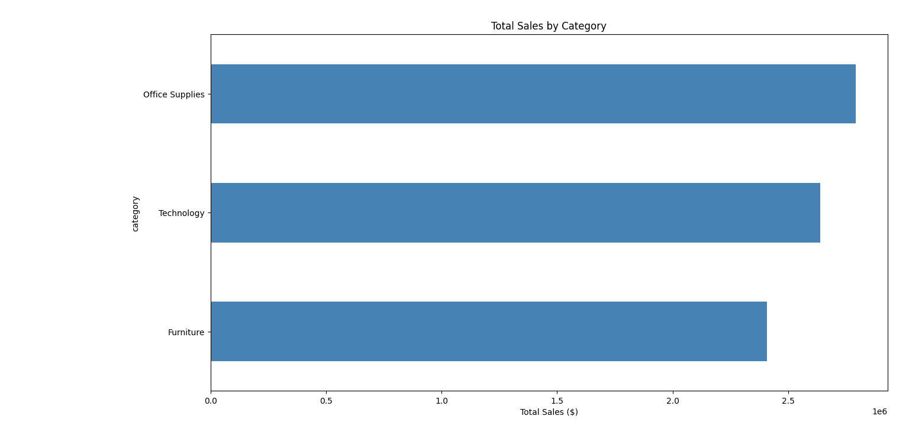

# E-commerce Sales Dashboard

## Overview
Analyzed **51,290 e-commerce orders** across 21 columns to identify sales trends, 
profit performance, and customer insights. The goal was to understand which 
categories drive the most revenue, how discounts impact profit, and how sales 
have grown over the years (2011–2014).

---

## Objectives
- Identify total sales, profit, and profit margin across all orders
- Analyze which product categories generate the most revenue
- Understand the impact of discounts on profit and loss orders
- Explore customer segments and regional performance
- Build an interactive dashboard to visualize key metrics

---

## Tools Used
- **MySQL Workbench** — wrote SQL queries to analyze sales, profit, category 
  performance, and discount impact
- **Python (Pandas, Matplotlib)** — loaded, cleaned, and visualized the dataset
- **Excel** — explored and reviewed the cleaned data
- **Power BI** — built an interactive dashboard with KPI cards, charts, map, 
  and year slicer

---

## Dataset
- **Total Orders:** 51,290
- **Total Columns:** 21
- **Data includes:** Customer details, order information, product category, 
  sales, profit, discount, segment, region, and shipping details

---

## SQL Queries Used

**Query 1: Sales by Category**
```sql
SELECT category, SUM(sales) AS Total_Sales
FROM ecommerce_cleaned
GROUP BY category
ORDER BY Total_Sales DESC;
```
Objective: Identify which product category generates the most revenue.

---

**Query 2: Top 5 Customers**
```sql
SELECT customer_name, SUM(sales) AS Total
FROM ecommerce_cleaned
GROUP BY customer_name
ORDER BY Total DESC
LIMIT 5;
```
Objective: Find the top 5 customers by total sales.

---

**Query 3: Region Performance**
```sql
SELECT region, SUM(sales) AS Sales
FROM ecommerce_cleaned
GROUP BY region
ORDER BY Sales DESC;
```
Objective: Identify which region performs best in sales.

---

**Query 4: Profit by Category**
```sql
SELECT category, SUM(profit) AS Total_Profit
FROM ecommerce_cleaned
GROUP BY category
ORDER BY Total_Profit DESC;
```
Objective: Find which category is most profitable.

---

**Query 5: Profit Margin by Category**
```sql
SELECT
    category,
    ROUND(SUM(sales), 2) AS Total_Sales,
    ROUND(SUM(profit), 2) AS Total_Profit,
    ROUND(SUM(profit) / SUM(sales) * 100, 2) AS Profit_Margin_Pct
FROM ecommerce_cleaned
GROUP BY category
ORDER BY Profit_Margin_Pct DESC;
```
Objective: Calculate profit margin percentage for each category.

---

**Query 6: Categories Above 2 Million Sales**
```sql
SELECT category, ROUND(SUM(sales), 2) AS Total_Sales
FROM ecommerce_cleaned
GROUP BY category
HAVING Total_Sales > 2000000
ORDER BY Total_Sales DESC;
```
Objective: Filter only high-performing categories using HAVING clause.

---

**Query 7: Discount Impact on Profit**
```sql
SELECT
    CASE
        WHEN discount = 0     THEN 'No Discount'
        WHEN discount <= 0.20 THEN 'Low Discount'
        ELSE                       'High Discount'
    END AS Discount_Label,
    COUNT(*) AS Total_Orders,
    ROUND(AVG(profit), 2) AS Avg_Profit,
    SUM(CASE WHEN profit < 0 THEN 1 ELSE 0 END) AS Loss_Orders
FROM ecommerce_cleaned
GROUP BY Discount_Label
ORDER BY Avg_Profit DESC;
```
Objective: Analyze how discount levels affect average profit and loss orders.

---

## Key Findings

**Office Supplies is the top category** with the highest total sales (~2.73M), 
followed by Technology (~2.66M) and Furniture (~2.43M).

**Sales grew consistently from 2011 to 2014** — rising from ~1.38M in 2011 to 
~2.67M in 2014, showing strong year-over-year growth.

**Consumer segment is the most profitable** customer group, followed by 
Corporate and Home Office.

**Total Sales across all orders** was $4,110,884 with a total profit of $286,780 
and an overall profit margin of ~6.97%.

**High discounts are killing profit** — orders with high discounts show negative 
average profit, meaning the business loses money on heavily discounted orders.

**Central region leads** in sales by region, followed by East, West, and South.

---

## Dashboard Preview



---

## Findings and Conclusion

- **Sales Performance:** Sales grew consistently every year from 2011 to 2014, 
  indicating a healthy and growing business.
- **Category Insights:** Office Supplies leads in revenue but Technology has a 
  higher profit margin, making it more efficient per dollar sold.
- **Discount Problem:** High discounts directly cause loss orders. Reducing 
  aggressive discounting would significantly improve overall profit margin.
- **Customer Segments:** The Consumer segment drives the most orders and profit, 
  making it the most important group to focus on.
- **Regional Performance:** The Central region leads in sales, but all four 
  regions show healthy contribution.

This analysis provides a clear picture of the business's sales health, category 
performance, and the critical impact of discounting on profitability.

---

## Files
| File | Description |
|------|-------------|
| `ecommerce_code.py` | Python script for data cleaning and visualization |
| `ecommerce_queries.sql` | SQL queries written in MySQL Workbench |
| `ecommerce_cleaned.csv` | Cleaned dataset |
| `ecommerce_cleaned.xlsx` | Excel version of the dataset |
| `Ecommerce_Dashboard.pbix` | Power BI interactive dashboard |
| `ecom.png` | Sales by category chart |
| `ecom_chart_2.png` | Yearly sales trend chart |

---

## Author
**Sariya Khan** — Aspiring Data Analyst
GitHub: [Sariyaaa](https://github.com/Sariyaaa)
