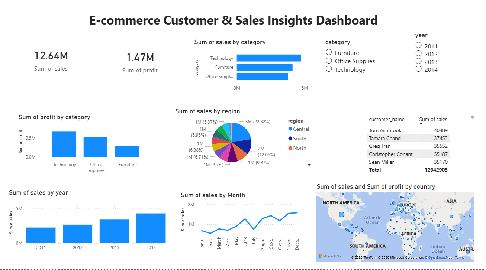

# E-commerce Sales Dashboard

## Overview
Analyzed **51,290 e-commerce orders** across 21 columns to identify sales trends, 
profit performance, and customer insights. The goal was to understand which 
categories drive the most revenue, how discounts impact profit, and how sales 
have grown over the years (2011–2014).

---

## Objectives
- Identify total sales, profit, and profit margin across all orders
- Analyze which product categories generate the most revenue
- Understand the impact of discounts on profit and loss orders
- Explore customer and regional performance
- Build an interactive dashboard to visualize key metrics

---

## Tools Used
- **MySQL Workbench** — wrote SQL queries to analyze sales, profit, category 
  performance, and discount impact
- **Python (Pandas)** — loaded and cleaned the dataset
- **Excel** — explored and reviewed the cleaned data
- **Power BI** — built an interactive dashboard with KPI cards, charts, map, 
  and category/region/year slicers

---

## Dataset
- **Total Orders:** 51,290
- **Total Columns:** 21
- **Data includes:** Customer details, order information, product category, 
  sales, profit, discount, segment, region, and shipping details

---

## Data Quality Fix

While cross-checking SQL results against the Power BI dashboard (same source 
data), total sales did not match between the two — SQL reported a noticeably 
lower figure than Power BI.

**Root cause:** the `sales` column was stored as text, and 2,630 rows used 
comma thousand-separators (e.g. `"1,648"`). MySQL's implicit string-to-number 
cast inside `SUM()` truncates at the first non-numeric character, so `"1,648"` 
was being read as just `1` — silently undercounting total sales by roughly 
4.8M (about 38% of true sales).

**Fix applied:**
```sql
UPDATE ecommerce_cleaned
SET sales = REPLACE(sales, ',', '')
WHERE sales LIKE '%,%';
```

After the fix, SQL and Power BI totals matched exactly at **$12,642,905**. 
All queries and findings below reflect the corrected data.

---

## SQL Queries Used

**Query 1: Sales by Category**
```sql
SELECT category, ROUND(SUM(sales), 2) AS Total_Sales
FROM ecommerce_cleaned
GROUP BY category
ORDER BY Total_Sales DESC;
```
Objective: Identify which product category generates the most revenue.

---

**Query 2: Top 5 Customers**
```sql
SELECT customer_name, ROUND(SUM(sales), 2) AS Total_Sales
FROM ecommerce_cleaned
GROUP BY customer_name
ORDER BY Total_Sales DESC
LIMIT 5;
```
Objective: Find the top 5 customers by total sales.

---

**Query 3: Region Performance**
```sql
SELECT region, ROUND(SUM(sales), 2) AS Total_Sales
FROM ecommerce_cleaned
GROUP BY region
ORDER BY Total_Sales DESC;
```
Objective: Identify which region performs best in sales.

---

**Query 4: Profit by Category**
```sql
SELECT category, ROUND(SUM(profit), 2) AS Total_Profit
FROM ecommerce_cleaned
GROUP BY category
ORDER BY Total_Profit DESC;
```
Objective: Find which category is most profitable.

---

**Query 5: Profit Margin by Category**
```sql
SELECT
    category,
    ROUND(SUM(sales), 2) AS Total_Sales,
    ROUND(SUM(profit), 2) AS Total_Profit,
    ROUND(SUM(profit) / SUM(sales) * 100, 2) AS Profit_Margin_Pct
FROM ecommerce_cleaned
GROUP BY category
ORDER BY Profit_Margin_Pct DESC;
```
Objective: Calculate profit margin percentage for each category.

---

**Query 6: Categories Above $2 Million Sales**
```sql
SELECT category, ROUND(SUM(sales), 2) AS Total_Sales
FROM ecommerce_cleaned
GROUP BY category
HAVING Total_Sales > 2000000
ORDER BY Total_Sales DESC;
```
Objective: Filter only high-performing categories using the HAVING clause.

---

**Query 7: Discount Impact on Profit**
```sql
SELECT
    CASE
        WHEN discount = 0     THEN 'No Discount'
        WHEN discount <= 0.20 THEN 'Low Discount'
        ELSE                       'High Discount'
    END AS Discount_Label,
    COUNT(*) AS Total_Orders,
    ROUND(AVG(profit), 2) AS Avg_Profit,
    SUM(CASE WHEN profit < 0 THEN 1 ELSE 0 END) AS Loss_Orders
FROM ecommerce_cleaned
GROUP BY Discount_Label
ORDER BY Avg_Profit DESC;
```
Objective: Analyze how discount levels affect average profit and loss orders.

---

**Query 8: Sales by Year**
```sql
SELECT year, COUNT(*) AS Order_Count, ROUND(SUM(sales), 2) AS Total_Sales
FROM ecommerce_cleaned
GROUP BY year
ORDER BY year;
```
Objective: Track year-over-year sales growth from 2011 to 2014.

---

## Key Findings

**Technology is the top-performing category overall** — highest total sales 
($4.74M), highest total profit ($663.8K), and highest profit margin (13.99%). 
Office Supplies is the second-most profitable category by margin (13.69%), 
while Furniture, despite generating solid sales ($4.11M), converts that into 
the weakest profit margin of the three (6.98%).

**Sales grew consistently from 2011 to 2014** — rising from $2.26M in 2011 to 
$4.30M in 2014, a year-over-year increase of roughly 90%.

**High discounts are hurting profit** — orders with high discounts averaged 
**–$71.92 profit**, compared to **+$61.04 profit** for orders with no discount. 
Heavily discounted orders are far more likely to result in a loss.

**Total sales across all orders:** $12,642,905, with total profit of 
$1,469,034.82 and an overall blended profit margin of approximately 11.62%.

---

## Dashboard Preview


---

## Findings and Conclusion

- **Sales Performance:** Sales grew consistently every year from 2011 to 2014, 
  nearly doubling over the period — indicating a healthy and growing business.
- **Category Insights:** Technology leads on every measure — sales, profit, 
  and margin — making it the strongest category overall. Furniture generates 
  solid sales volume but is the least efficient at converting that into profit.
- **Discount Problem:** High discounts directly cause loss orders. Reducing 
  aggressive discounting would meaningfully improve overall profit margin.
- **Regional Performance:** Regional sales are explored in the dashboard via 
  an interactive region slicer, allowing comparison across all regions.

This analysis provides a clear picture of the business's sales health, category 
performance, and the critical impact of discounting on profitability. It also 
reflects a real data-quality issue identified and resolved during analysis — 
a comma-formatting bug in the sales column that was silently undercounting 
totals until caught by cross-checking SQL output against the Power BI dashboard.

---

## Files
| File | Description |
|------|-------------|
| `ecommerce code.py` | Python script for data loading and cleaning |
| `ecommerce queries.sql` | SQL queries written in MySQL Workbench |
| `ecommerce_cleaned.csv` | Cleaned dataset |
| `ecommerce_cleaned.xlsx` | Excel version of the dataset |
| `Ecommerce_Dashboard.pbix` | Power BI interactive dashboard |
| `Ecommerce_Dashboard.png` | Power BI dashboard preview image |

---

## Author
**Sariya Khan** — Aspiring Data Analyst
GitHub: [Sariyaaa](https://github.com/Sariyaaa)
